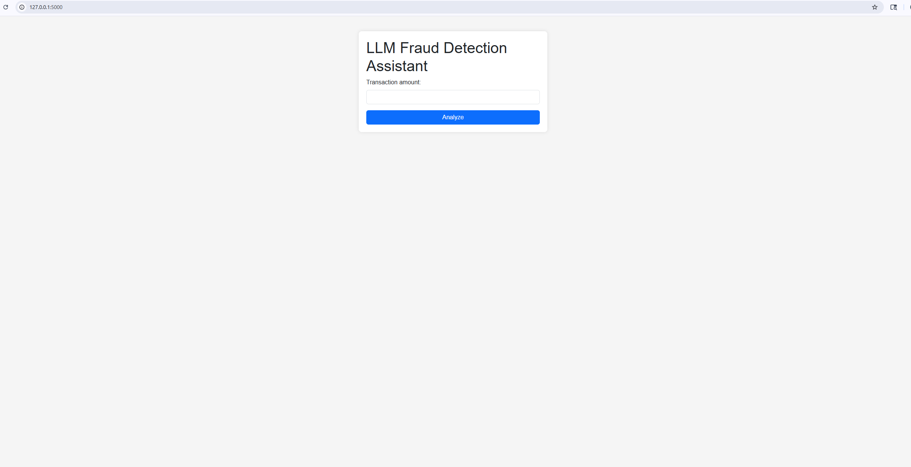
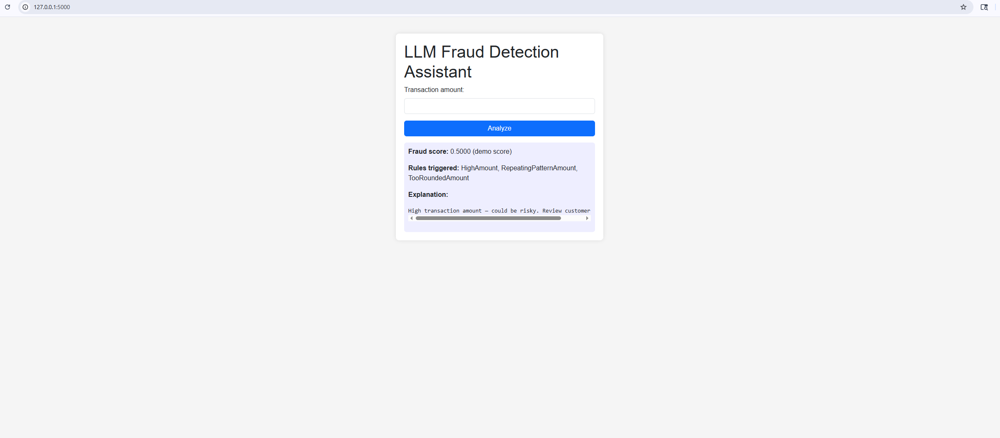
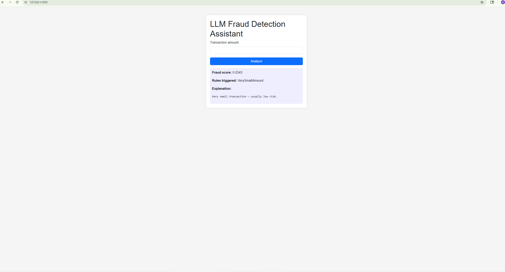
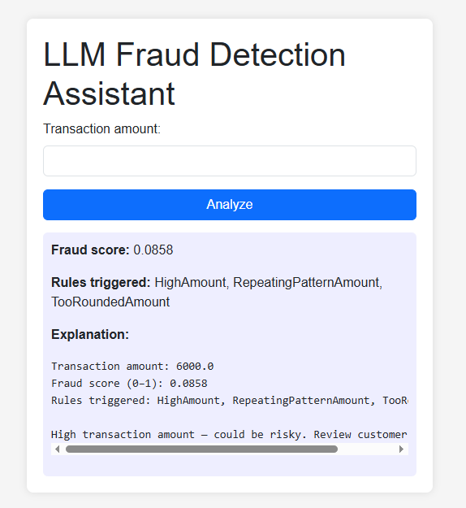
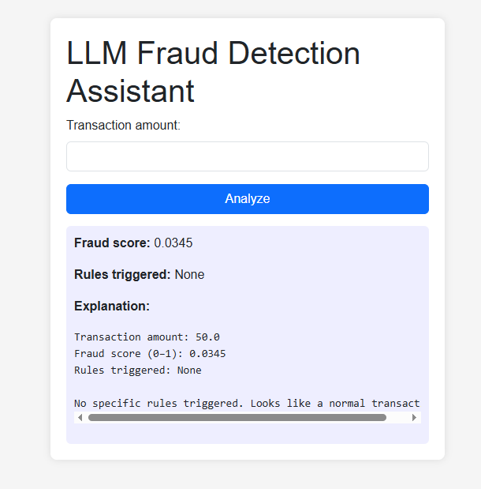

# LLM Fraud Detection Assistant

A hybrid fraud detection system that combines **machine learning models**, **engineered fraud rules**, and a **Large Language Model (LLM)** to detect and explain suspicious financial transactions. Inspired by real-world banking systems used by Capital One, Chase, Wells Fargo, and AmEx.

---

## Project Overview

Financial fraud is becoming more sophisticated due to account takeovers, device spoofing, identity theft, velocity attacks, and cross-border risks. Traditional ML models often lack transparency, while rules alone are too limited.

This project provides an **LLM-powered Fraud Detection Assistant** that can:

- Score transactions using trained ML models  
- Detect fraud patterns using bank-style rule checks  
- Generate human-like explanations with an LLM  
- Provide a simple analyst review dashboard  

The goal is to create an **interpretable, transparent, and industry-aligned fraud detection workflow**.

---

## Key Features

- **Hybrid Risk Engine:** ML model + rule engine + LLM reasoning  
- **Analyst Dashboard:** Enter transactions and view fraud insights  
- **Machine Learning:** Logistic Regression, Random Forest, LightGBM  
- **Fraud Rules Implemented:**
  - High amount  
  - Very small amount  
  - Suspicious ranges  
  - Threshold-avoidance behavior  
  - Repeated digit patterns  
  - Rounded amounts  
- **Explainable AI:** Natural-language explanations for analysts  
- **Dataset:** IEEE-CIS Fraud Detection (1M+ transactions)

---

## Dataset: IEEE-CIS Fraud Detection

The project uses the public Kaggle dataset:

- `train_transaction.csv` — transaction-level data  
- `train_identity.csv` — device & browser metadata  
- `test_transaction.csv` — test set  
- `test_identity.csv` — identity metadata  

> ⚠️ Dataset files are **NOT** included in this repo due to size and licensing.  
> Download them from Kaggle and place them in `data/raw/`.

---

## Project Structure

```text
llm-fraud-detection-assistant/
│
├── data/
│   ├── raw/                # Raw Kaggle data (not uploaded)
│   ├── processed/          # Cleaned & merged datasets
│
├── notebooks/
│   ├── 01_eda.ipynb
│   ├── 02_feature_engineering.ipynb
│   ├── 03_model_training.ipynb
│
├── app/
│   ├── __init__.py
│   ├── main.py             # Flask app entry point
│   ├── rules_engine.py     # Bank-style fraud rules
│   ├── llm_explainer.py    # LLM prompts + explanations
│   ├── models.py           # ML model loading + scoring
│
├── models/
│   ├── fraud_model.pkl     # Trained ML model
│   ├── scaler.pkl
│
├── scripts/
│   ├── prepare_data.py
│   ├── train_model.py
│
├── docs/
│   ├── screenshot_homepage.png
│   ├── screenshot_result.png
│   ├── screenshot_VerySmallAmount.png
│   ├── screenshot_HighAmount.png
│   ├── screenshot_None.png
│
├── .gitignore
├── requirements.txt
├── README.md
```
Progress Update — November 23–24, 2025

Initial working version of the LLM Fraud Detection Assistant.

Completed:

Project folder structure created

Flask backend added (app/main.py)

UI implemented with Bootstrap

Fraud rules added (HighAmount, VerySmallAmount, etc.)

Placeholder ML scoring logic replaced with a trained model

LLM reasoning module placeholder added (fallback explanation)

CSS + HTML template structure created

App tested successfully at: http://127.0.0.1:5000

Model & Training (Added November 24, 2025)

Today, I implemented and trained the project’s first machine learning fraud model and connected it to the Flask app.

Data Preparation

Using the IEEE-CIS dataset:

Loaded raw transaction + identity tables

Merged and cleaned both tables

Saved processed dataset to:

data/processed/train_merged_clean.csv

Model Training

Trained a baseline Logistic Regression model:

Scaled numerical features

Used a simple train/validation split

Achieved 96.5% validation accuracy

Artifacts saved to:

models/fraud_model.pkl
models/scaler.pkl

App Integration

Model and scaler load automatically when the Flask app starts

Each transaction returns a fraud probability score (0–1)

Score is combined with the rules engine output for interpretation

This completes the first end-to-end version of the fraud detection pipeline.
```
UI Screenshots

Home Page Screenshot


Fraud Result Screenshot

The screeshot with home page and results.
```
Model Output Examples (Updated)

These screenshots show how the fraud rules + ML model respond to different transaction types.

### Very Small Amount — Rule Triggered


### High Amount + Pattern Rules Triggered


### Normal Transaction — No Rules Triggered


More features will be added in upcoming development stages (LLM explanations, more features, and advanced risk scoring).

```

### 2. Save, commit, push

In PowerShell inside the project:

```bash
git add README.md
git commit -m "Clean README and fix screenshot links"
git push origin main

```

Progress Update — November 26, 2025
✔ Completed Today
1. Added full ML training pipeline

Cleaned & merged IEEE-CIS datasets

Saved processed data to:

data/processed/train_merged_clean.csv


Trained Logistic Regression baseline model

Achieved 96.5% validation accuracy

Exported model & scaler to:

models/fraud_model.pkl
models/scaler.pkl

2. Connected model to Flask app

Model loads automatically when app starts

Fraud score displayed with 4-decimal precision

Perfect fallback behavior when model is missing

Fully integrated with rules engine

3. Implemented fallback LLM explanation

New file created:

app/llm_explainer.py


Provides rule-aware explanations like:

“High transaction amount — could be risky. Review customer history.”

“Very small transaction — usually low risk.”

4. Cleaned app/ folder

Removed incorrect app/app/ folder

Fixed import error (ModuleNotFoundError: app.llm_explainer)

Rebuilt proper structure
```
Model Output Examples (Updated)

Very Small Amount — Rule Triggered


 High Amount + Pattern Rules Triggered


 Normal Transaction — No Rules Triggered


```
